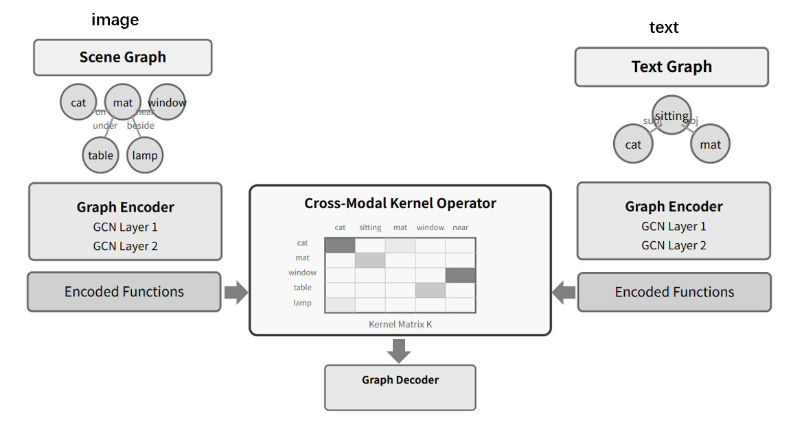

# Neural Operators for Cross-Modal Graph Alignment

[](LICENSE)
[](https://www.python.org/)
[](https://pytorch.org/)

Official code for the paper:

> **Neural Operators for Cross-Modal Graph Alignment**  
> Bailing Zhang  
> *Pattern Recognition*, Volume 180, 2026, 114456  
> DOI: [10.1016/j.patcog.2026.114456](https://doi.org/10.1016/j.patcog.2026.114456)

## Overview

Graph Neural Operators (GNOs) learn **function-to-function mappings** between graph-structured representations across modalities, providing:

- **Interpretable** entity-level alignment (not black-box global embeddings)
- **Data-efficient** few-shot learning (500 training samples on Flickr30K)
- **Robust** performance under structural noise (< 4% degradation at 30% perturbation)

<p align="center"></p>

## Key Results

| Dataset | Train Samples | F1 | AUC |
|---------|:---:|:---:|:---:|
| Flickr30K | 500 | **0.5662** | 0.6250 |
| Visual Genome | 5,000 | 0.3159 | — |

The weighted loss design achieves a **180-fold F1 improvement** over naive training on sparse alignment labels.

## Project Structure

```
neural-graph-operator/
├── configs/
│   ├── flickr30k.yaml          # Flickr30K experiment config
│   └── visual_genome.yaml      # Visual Genome experiment config
├── src/
│   ├── models/
│   │   └── gno_model.py        # GNO model (all kernel variants + baselines)
│   ├── data/
│   │   ├── flickr30k_dataset.py
│   │   └── vg_dataset.py
│   ├── losses.py               # Loss functions (Eq. 9–12)
│   └── utils.py                # Evaluation metrics
├── experiments/
│   ├── train_flickr30k.py      # Main Flickr30K training
│   ├── train_vg.py             # Visual Genome training
│   ├── ablation_study.py       # Ablation experiments (Table 2)
│   ├── comparison_baselines.py # Baseline comparison (Table 1)
│   ├── robustness_study.py     # Noise robustness (Table 3)
│   └── scaling_study.py        # Computational scaling (Figure 5)
├── analysis/
│   └── plot_figures.py         # Generate all paper figures
├── environment.yml             # Conda environment
├── requirements.txt            # Pip requirements
└── CITATION.cff
```

## Installation

### Option A: Conda (recommended)

```bash
conda env create -f environment.yml
conda activate gno
python -m spacy download en_core_web_sm
python -c "import nltk; nltk.download('wordnet'); nltk.download('omw-1.4')"
```

### Option B: Pip

```bash
pip install -r requirements.txt
# Install PyG extensions for your CUDA version — see https://pyg.org/
pip install torch-scatter torch-sparse -f https://data.pyg.org/whl/torch-2.1.0+cu121.html
python -m spacy download en_core_web_sm
python -c "import nltk; nltk.download('wordnet'); nltk.download('omw-1.4')"
```

## Data Preparation

Download and place datasets under `./data/`:

- **Flickr30K**: [Flickr30K Entities](https://github.com/BryanPlummer/flickr30k_entities) — place `results.csv` and `flickr30k_images/` in `./data/flickr30k/`
- **Visual Genome**: [Visual Genome v1.2](https://homes.cs.washington.edu/~ranjay/visualgenome/) — place `objects_v1_2.json` etc. in `./data/visual_genome/`

Or edit paths in `configs/*.yaml` to point to your existing data directories.

## Usage

### Training

```bash
# Flickr30K (reproduces Table 2 full model, ~10 min on RTX 2070)
python experiments/train_flickr30k.py --config configs/flickr30k.yaml

# Visual Genome — template text mode
python experiments/train_vg.py --config configs/visual_genome.yaml --text-mode template

# Visual Genome — natural text mode
python experiments/train_vg.py --config configs/visual_genome.yaml --text-mode natural
```

### Reproducing Paper Experiments

```bash
# Table 1: Baseline comparison (requires trained checkpoint)
python experiments/comparison_baselines.py --config configs/flickr30k.yaml \
    --checkpoint outputs/flickr30k/best_model.pth

# Table 2: Ablation study
python experiments/ablation_study.py --config configs/flickr30k.yaml --epochs 20

# Table 3 + Figure 4: Robustness analysis
python experiments/robustness_study.py --config configs/flickr30k.yaml \
    --checkpoint outputs/flickr30k/best_model.pth

# Figure 5: Scaling study
python experiments/scaling_study.py --config configs/flickr30k.yaml

# Generate all figures
python analysis/plot_figures.py --results-dir outputs/flickr30k
```

## Model Architecture

The `GraphNeuralOperator` (§3.2) consists of three components:

| Component | Paper Section | Implementation |
|-----------|:---:|---|
| Graph Encoders (Φ) | §3.2.1, Eq. 4–5 | `GCNEncoder`, `GATEncoder` |
| Cross-Modal Kernel (K) | §3.2.2, Eq. 6–7 | `BilinearKernel`, `MLPKernel`, `AttentionKernel`, `LowRankKernel` |
| Graph Decoder (Ψ) | §3.2.3, Eq. 8 | `GraphDecoder` |
| Training Loss | §3.3, Eq. 9–12 | `losses.py` |

## Configuration

Key hyperparameters in `configs/flickr30k.yaml`:

| Parameter | Default | Description |
|-----------|:---:|---|
| `model.kernel_type` | bilinear | Kernel variant: bilinear / mlp / attention / lowrank |
| `model.hidden_dim` | 128 | Hidden representation dimension |
| `model.num_encoder_layers` | 2 | GCN depth |
| `train.pos_weight` | 5.0 | Positive-class weight for sparse labels |
| `train.epochs` | 50 | Maximum training epochs |

## Citation

If you find this work useful, please cite:

```bibtex
@article{ZHANG2026114456,
  title={Neural operators for cross-modal graph alignment},
  author={Zhang, Bailing},
  journal={Pattern Recognition},
  volume={180},
  pages={114456},
  year={2026},
  issn={0031-3203},
  doi={https://doi.org/10.1016/j.patcog.2026.114456}
}
```

## License

This project is licensed under the MIT License — see [LICENSE](LICENSE) for details.
